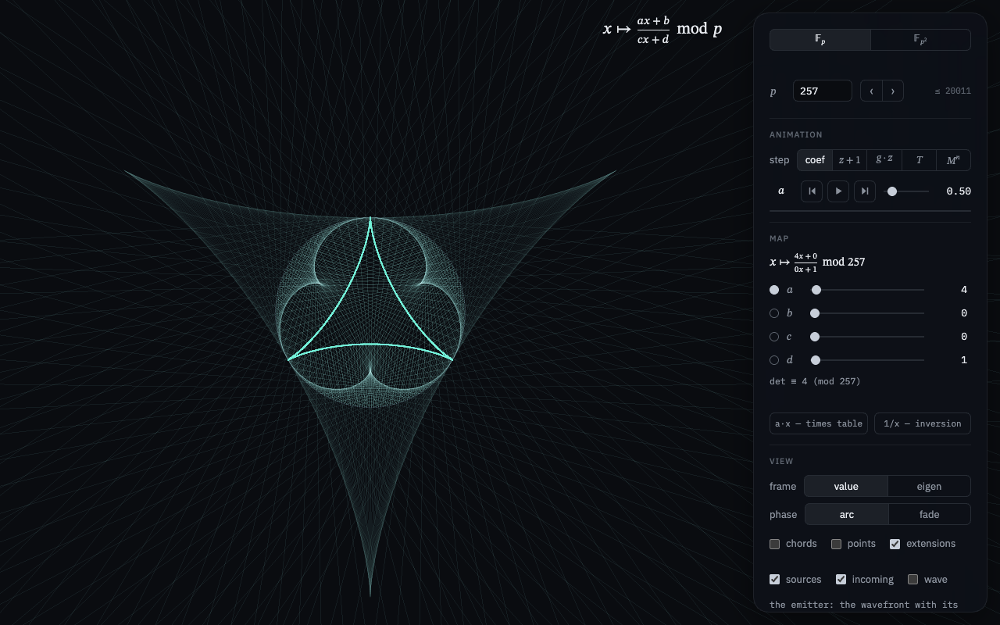

# Умножение в полях Галуа

Интерактивная визуализация дробно-линейного отображения

$$z \mapsto \frac{az + b}{cz + d}$$

над конечными полями $`\mathbb{F}_p`$ и $`\mathbb{F}_{p^2}`$. Элементы
$`\mathbb{F}_p`$ — точки окружности, элементы $`\mathbb{F}_{p^2}`$ — точки
тора; линия соединяет элемент с его образом.

Живая версия: [evgkch.github.io/galois](https://evgkch.github.io/galois/).
English: [README.md](README.md).

| [](https://evgkch.github.io/galois/) | [](https://evgkch.github.io/galois/?a=0&b=1&c=1&d=0) | [](https://evgkch.github.io/galois/?mode=fp2) |
| :--: | :--: | :--: |
| Карта $x \mapsto 2x$ при $p = 257$: огибающая хорд — кардиоида ([открыть](https://evgkch.github.io/galois/)). | Инверсия $x \mapsto x^{-1}$ при $p = 257$: хорды соединяют взаимно обратные элементы ([открыть](https://evgkch.github.io/galois/?a=0&b=1&c=1&d=0)). | Карта $z \mapsto 2z$ в $`\mathbb{F}_{257^2}`$: отрезки переходов и их продолжения ([открыть](https://evgkch.github.io/galois/?mode=fp2)). |

## Окружность: поле 𝔽p

Поле $`\mathbb{F}_p`$ — вычеты $\{0, 1, \dots, p-1\}$ по модулю простого $p$.
Его элементы — точки окружности в $\mathbb{R}^2$, по кругу в порядке
$0, 1, \dots, p-1$. Преобразование

$$x \mapsto \frac{ax + b}{cx + d} \pmod{p}$$

изображается линиями: отрезок соединяет точку $x$ с её образом.

Деление — умножение на обратный элемент: например, в $`\mathbb{F}_7`$
обратный к $3$ — это $5$, потому что $3 \cdot 5 \equiv 1$.

Совокупность $p$ отрезков изображает карту целиком; классическая «таблица
умножения на окружности» — частный случай $x \mapsto ax$. При $a = 2$
огибающая отрезков — кардиоида, при $a = 3$ — нефроида; при больших $a$ —
эпициклоиды с $a - 1$ остриями ([$a = 5$](https://evgkch.github.io/galois/?a=5)).
Почему это эпициклоиды, показано в следующем разделе.

Полюс $`x_0 = -d/c`$ переходит в бесконечность проективной прямой
$`\mathbb{P}^1(\mathbb{F}_p) = \mathbb{F}_p \cup \{\infty\}`$; отрезок из
него не рисуется. При $ad - bc \equiv 0$ отображение вырождено — все
образы совпадают.

## Каустика и источник

Та же картинка — оптическая сцена. Окружность — зеркало: изнутри
отражает, снаружи прозрачно и не преломляет. Хорда от $x$ к $f(x)$ — луч,
пришедший в точку $x$, отражённый и ушедший в $f(x)$. Откуда он пришёл,
задаёт закон отражения, поэтому у каждой хорды есть свет до отражения, и
вопрос в том, как устроен этот свет. Ответ: все падающие лучи касаются
одной кривой, каустики падающего света; для $x \mapsto 2x$ это точка на ободе, для $x \mapsto 3x$ —
бесконечность, для остальных умножений — эпициклоида или гипоциклоида с
$|a - 1|$ остриями. Доказательство в четыре шага.

**Падающий луч.** Пусть $P(\theta) = R e^{i\theta}$, элемент $x$ помещён
в $P(2\pi x/p)$. Угол между хордой и касательной равен половине
стягиваемой дуги, а по закону отражения углы падающей и отражённой хорд с
касательной равны, значит, равны и дуги: луч, пришедший в $P(\gamma)$ из
$P(\alpha)$, уходит в $P(2\gamma - \alpha)$. Поэтому хорда
$[P(\theta), P(a\theta + \beta)]$, $\beta = 2\pi b/p$, — отражение хорды из
$P(m\theta - \beta)$, где $m = 2 - a$; для элементов падающий луч идёт из
$mx - b$ в $x$. Падающий луч вычислен из хорды, а не выбран, так что
отражённые лучи сцены совпадают с хордами по построению; содержательно
лишь то, что у них есть простой источник.

**Каустика падающего света.** Семейство лучей фокусируется там, где соседние
лучи пересекаются; множество таких точек — каустика, огибающая
семейства. Падающие лучи проходят через $P(\theta)$ и $P(m\theta)$, а
поворот на $`c_0 = \beta/(m - 1)`$ убирает сдвиг $\beta$. Прямая через
$P(\theta)$ и $P(m\theta)$ имеет уравнение
$x\cos\varphi + y\sin\varphi = R\cos\delta$, $\varphi = (m+1)\theta/2$,
$\delta = (m-1)\theta/2$; её пересечение с соседней прямой удовлетворяет
и производной по $\theta$, и решение системы —

$$E(\theta) = \frac{R}{m + 1}\left(m e^{i\theta} + e^{im\theta}\right).$$

Каждый падающий луч касается $E$ в одной точке, и $E$ — единственная
такая кривая. Это каустика падающего света, и в этом смысле его
источник: свет идёт по касательным к $E$. Что его излучает — ниже.

**Катящееся колесо.** Формула для $E$ — сумма двух плеч: длинного,
$`r_1 = mR/(m+1)`$, повёрнутого на $\theta$, и короткого, $`r_2 = R/(m+1)`$,
повёрнутого на $m\theta$. Так движется точка обода колеса радиуса
$`|r_2|`$, центр которого движется по окружности радиуса $`|r_1|`$, а само
колесо вращается в $m$ раз быстрее. Колесо катится без скольжения тогда и только
тогда, когда точка обода в момент касания неподвижна. Скорость точки

$$E'(\theta) = i\,r_1 e^{i\theta} + i\,m r_2 e^{im\theta}$$

— сумма векторов длин $`|r_1|`$ и $`|m|\,|r_2|`$, она обращается в нуль
лишь при $`|r_1| = |m|\,|r_2|`$, а это тождество. Итак, $E$ — след точки
катящегося колеса. При $m > 1$ плечи вращаются в одну сторону, колесо
обкатывает неподвижную окружность снаружи: эпициклоида. При $m < -1$ они
вращаются в разные стороны, колесо катится внутри: гипоциклоида.
Остановки точки — острия; за оборот длинного плеча колесо делает $m - 1$
оборотов относительно него, поэтому остриёв $|m - 1| = |a - 1|$, и лежат
они на окружности радиуса $`|r_1 - r_2| = R\,|m - 1|/|m + 1|`$. При $m = 2$
это кардиоида, при $m = 3$ нефроида, при $m = -2$ дельтоида с остриями
на $3R$.

**Положение каустики.** Падающий свет приходит в $x$ изнутри диска, поэтому
$E$ лежит либо внутри круга, либо за зеркалом. В первом случае свет
расходится от кривой по её касательным, во втором сходится к ней, и зеркало
перехватывает его до фокуса. Знак $m$ различает эти случаи.

| $a$ | $m$ | Кривая $E$ | Свет |
| --- | --- | --- | --- |
| $2$ | $0$ | точка на ободе, элемент $-b$ | точечный источник |
| $3$ | $-1$ | на бесконечности | параллельный пучок с двух сторон |
| $\ge 4$ | $\le -2$ | гипоциклоида с $a - 1$ остриями вне круга, острия на радиусе $R\,\frac{a-1}{a-3}$ | сходится к кривой за зеркалом |
| $\le 0$ | $\ge 2$ | эпициклоида с $1 - a$ остриями внутри круга | расходится от кривой |

Излучатель — фронт $W$ с остриями на зеркале, эвольвента $E$, о нём
ниже. При $a \ge 4$ он лежит внутри диска, и свет идёт от него прямо к
зеркалу; при $a \le 0$ он снаружи, свет входит сквозь стенку в точке
$mx - b$ и по пути касается $E$. После отражения свет идёт по хорде в
$ax + b$ и выходит сквозь стенку. При $a \le -2$ отражённые лучи
расходятся от гипоциклоиды за зеркалом, мнимого изображения излучателя;
продолжения хорд назад за окружность, которые рисует алгебра, ведут к
ней.

**Каустика и фронт.** Лучи — нормали к волновому фронту, а фронты —
эвольвенты каустики, линии постоянного оптического пути. Зеркало
переводит одну каустику в другую: падающий свет фокусируется на $E$,
отражённый — на огибающей хорд. Та же формула с $m$, заменённым на $a$,
даёт огибающую хорд $\theta \to a\theta$, и то же колесо — эпициклоиду с
$a - 1$ остриями: кардиоиду при $a = 2$, нефроиду при $a = 3$. Сама $E$ —
не фронт: фронты падающего света — эвольвенты $E$, эквидистанты друг
друга. Один из них — кривая того же типа, подобная $E$ с коэффициентом
$|a - 3|/|a - 1|$ и повёрнутая на полшага между остриями; его острия лежат
на зеркале, в точках касания $E$ с окружностью, то есть в неподвижных
точках карты $x \mapsto mx$. Этот фронт сцена показывает как излучатель.

**Что излучает.** Сама $E$ не излучает: это каустика, место, где
падающие лучи касаются друг друга. Кривая, светящаяся во все стороны из
каждой точки, дала бы двухпараметрическое семейство лучей и ровную
засветку без каустик; падающие лучи — однопараметрическое семейство.
Источник зависит от уровня описания.

| Уровень | Источник |
| --- | --- |
| лучи, конечное $p$ | $p$ направленных пучков вдоль касательных к $E$; излучатель каждого стоит где угодно на его прямой |
| лучи, $p \to \infty$ | фронт, любая из эвольвент $E$; он излучает по своей нормали, а не во все стороны |
| волна | когерентная сумма точечных источников с фазами: точки одного фронта с общей фазой или точки зеркала с фазами оптического пути, шаг не больше $\lambda/2$ |

Изотропных точечных источников, дающих ровно эти лучи, нет, кроме
$a = 2$ и $a = 3$. Условие «точка $Q$ лежит на прямой семейства» —
тригонометрический многочлен от $\theta/2$ степени $|m| + 1 = |a - 2| + 1$,
поэтому через $Q$ проходит не больше $|a - 2| + 1$ прямых семейства, при
$a \ge 3$ — $a - 1$, по числу остриёв. Изотропные источники в остриях
дали бы при $a \ge 4$ картину, отличающуюся от точной на $2$–$3\%$
радиуса, при $a \le 0$ иную. Некогерентная сумма точечных источников
направленных лучей не даёт. Сцена рисует излучатель, фронт с остриями на
зеркале, и его свет до зеркала и после отражения.

**Конечное $p$.** Хорды поля — члены семейства при $\theta = 2\pi x/p$, и
при конечном $p$ падающий свет — $p$ лучей, касающихся $E$ в точках
$`E(2\pi x/p - c_0)`$; при $p \to \infty$ точки касания заполняют кривую. Число $a$ здесь — представитель из
$(-p/2, p/2]$: у карт $\times a$ и $\times (a - p)$ одни и те же хорды, но
соседние по $x$ хорды соседствуют лишь в семействе с наименьшим $|a|$.

[](https://evgkch.github.io/galois/?a=4&src=1&chords=0&points=0&rays=257&zoom=0.33&glow=1.5)

Карта $x \mapsto 4x$, хорды элементов скрыты. Излучатель — дельтоида,
вписанная в зеркало; свет идёт от неё по нормалям и сходится к дельтоиде
за зеркалом, каждый луч касается её;
зеркало отражает его раньше, и внутри круга отражённые лучи дают
огибающую хорд, а их продолжения наружу — свет после выхода ([открыть](https://evgkch.github.io/galois/?a=4&src=1&chords=0&points=0&rays=257&zoom=0.33&glow=1.5)).

**Дробно-линейные карты.** При $c \ne 0$ образы соседних элементов
$x$ и $x + 1$ отличаются на $\det/((cx + d)(cx + c + d))$, произвольный
вычет: на окружности, уложенной по значению, карта разрывна, и огибающей
у её хорд нет. Но она сопряжена умножению или повороту. С двумя
неподвижными точками $`u, v \in \mathbb{F}_p`$ в координате
$y = (x - u)/(x - v)$ она имеет вид $y \mapsto Ky$; с одной точкой $u$ в
координате $y = 1/(x - u)$ — вид $y \mapsto y + \tau$; с неподвижными точками
в $`\mathbb{F}_{p^2}`$ координата $y = (x - u)/(x - \bar u)$ имеет норму $1$,
и карта — поворот $p + 1$ элементов нормы один. В укладке по $y$ хорды
снова образуют непрерывное семейство: у умножения — с кривой $E$ карты
$\times K$, у поворота на угол $\alpha$ — с каустикой-окружностью радиуса
$R\cos(\alpha/2)$. Например, инверсия $x \mapsto x^{-1}$ имеет
неподвижные точки $\pm 1$, в координате $y = (x - 1)/(x + 1)$ равна
$y \mapsto -y$, все её хорды параллельны, а каустика падающего света — нефроида
радиуса $R/2$ ([открыть](https://evgkch.github.io/galois/?a=0&b=1&c=1&d=0&src=1&frame=eigen&ext=0)).

**Волна.** В волновом режиме поле строится по Гюйгенсу: источники —
точки зеркала, каждая переизлучает пришедшую волну с фазой её
оптического пути от излучателя, для умножений
$f(\theta) = \frac{2R}{|a - 1|}\left|\sin\frac{(a - 1)\theta + \beta}{2}\right|$,
поле в точке — сумма таких волн, яркость — квадрат её модуля, цвет
отвечает длине волны. Отражённые лучи, каустика и полосы возле неё —
стационарные точки этой суммы.

## Тор: поле 𝔽p²

Квадратичное расширение строится присоединением корня неприводимого
многочлена:

$$\mathbb{F}_{p^2} = \mathbb{F}_p[i]/(i^2 - \nu),$$

где $\nu$ — квадратичный невычет по модулю $p$. Например, при $p = 7$
квадраты ненулевых вычетов — $\{1, 2, 4\}$, и можно взять $\nu = 3$.
Каждый элемент однозначно записывается как $z = x + yi$; умножение
раскрывается по правилу $i^2 = \nu$. Обратный элемент выражается через
норму:

$$z^{-1} = \frac{\bar z}{N(z)}, \qquad N(z) = z\bar z = x^2 - \nu y^2, \qquad \bar z = x - yi.$$

Норма равна нулю только при $z = 0$, поскольку $\nu$ — не квадрат; поэтому
каждый ненулевой элемент обратим.

Элементы $`\mathbb{F}_{p^2}`$ — точки тора в $\mathbb{R}^3$: координаты $x$ и
$y$ откладываются вдоль двух обходов тора, обе периодичны с периодом $p$.
Преобразование изображается линиями в $\mathbb{R}^3$: отрезок соединяет
точку $z$ с её образом. Та же поверхность получается из таблицы
умножения $p \times p$ склейкой противоположных краёв.

Выбор невычета $\nu$ фиксирует базис $\{1, i\}$, а с ним и координаты: одна
и та же абстрактная карта при разных $\nu$ рисуется по-разному. Аффинные
карты с коэффициентами из простого подполя от $\nu$ не зависят; инверсия
$z \mapsto z^{-1}$ — зависит ([$\nu = 3$](https://evgkch.github.io/galois/?mode=fp2&a0=0&b0=1&c0=1&d0=0), [$\nu = 5$](https://evgkch.github.io/galois/?mode=fp2&a0=0&b0=1&c0=1&d0=0&ns=5)).

## Геометрические прогрессии

Мультипликативная группа $`\mathbb{F}_q^{\times}`$ (здесь $q = p$ или $p^2$)
циклична: для образующей $g$ каждый ненулевой элемент единственным образом
равен $g^k$, $0 \le k < q - 1$. Например, в $`\mathbb{F}_7`$ образующая —
тройка: её степени $3, 2, 6, 4, 5, 1$ перебирают все ненулевые вычеты.

**Экспоненциальная форма**: коэффициент задаётся показателем $k$ в записи
$g^k$; нулевой элемент — не степень $g$. Шаг анимации в этой форме умножает
коэффициент на $g$ — коэффициент пробегает геометрическую прогрессию
$g^k, g^{k+1}, \dots$

## Анимация

Переключатель «step» задаёт, что делает один шаг транспорта:

| Шаг   | Действие                                                                    |
| ----- | ---------------------------------------------------------------------------- |
| coef  | $+1$ к выбранной кружком компоненте; в форме $g^k$ — умножение её на $g$      |
| z+1   | вся карта: $M \mapsto SM$ со сдвигом $S\colon z \mapsto z + 1$                |
| g·z   | вся карта: $M \mapsto SM$ с гомотетией $S\colon z \mapsto gz$                 |
| T     | вся карта: $M \mapsto TM$ с матрицей $T$ из четырёх полей ввода               |
| $M^n$ | итерация самой карты: $n$-й шаг показывает $M^n$ ([пример](https://evgkch.github.io/galois/?step=iter&play=1)) |

Шаги z+1, g·z, T и $M^n$ обратимы, поэтому путь не выходит из
$`\mathrm{PGL}_2(\mathbb{F}_q)`$ и не проходит через вырожденные карты; путь
coef может пересекать множество $ad - bc \equiv 0$. Дискриминант

$$\Delta = (\mathrm{tr}\, S)^2 - 4 \det S$$

определяет тип шага $S$: hyperbolic — $\Delta$ квадрат, две неподвижные
точки на прямой; parabolic — $\Delta = 0$, одна; elliptic — $\Delta$
неквадрат, неподвижных точек на прямой нет, они лежат в квадратичном
расширении. Например, шаг $z \mapsto -1/z$ при $p \equiv 3 \pmod 4$
эллиптичен: его неподвижные точки — корни уравнения $z^2 = -1$, а они есть
только в $`\mathbb{F}_{p^2}`$ ([пример](https://evgkch.github.io/galois/?p=103&step=T&t=0,102,1,0&play=1)). Панель показывает тип и порядок шага: через
столько шагов анимация возвращается к исходной карте.

Переключатель «phase» задаёт отрисовку дробной фазы между шагами: arc —
конец хорды скользит по дуге к следующему образу; fade — обе соседние
диаграммы рисуются с весами $1 - t$ и $t$. Промежуточных карт внутри
конечного поля нет: arc — интерполяция вложения, fade показывает только
сами карты. Для сдвигов дуговая интерполяция совпадает с точным потоком.

[](https://evgkch.github.io/galois/?mode=fp2&form=exp)

Коэффициенты в форме $g^k$: $a = g^{37152} = 2$, знаменатель — $g^0 = 1$;
образующая $g = 1 + 5i$ ([открыть](https://evgkch.github.io/galois/?mode=fp2&form=exp)).

## Управление

| Элемент     | Действие                                                                 |
| ----------- | ------------------------------------------------------------------------ |
| 𝔽p / 𝔽p²   | переключает окружность и тор                                             |
| p           | характеристика поля; ‹ › шагают по простым, максимум показан рядом       |
| i²          | квадратичный невычет $\nu$, задающий $i$ (только $`\mathbb{F}_{p^2}`$)     |
| g           | образующая $`\mathbb{F}_q^{\times}`$ (форма $g^k$ и шаг g·z)               |
| form        | форма коэффициентов: $x + yi$ или $g^k$                                  |
| кружок в строке коэффициента | выбирает, какой коэффициент двигает транспорт (шаг coef) |
| step        | что делает шаг: coef, z+1, g·z, T или $M^n$                              |
| phase       | отрисовка фазы между шагами: дуга или кросс-фейд                         |
| ⏮ ▶ ⏭       | шаг $-1$, воспроизведение и пауза (пробел), шаг $+1$                     |
| speed       | шагов в секунду; полоска под транспортом — фаза перехода                 |
| пресеты     | a·x и 1/x на окружности; a·z, i·z и 1/z на торе                          |
| число у ползунка | поле ввода: точное значение коэффициента, приводится по модулю $p$ |
| frame       | укладка элементов: по значению или по собственной координате карты, где она умножение или поворот (только $`\mathbb{F}_p`$) |
| view        | хорды; точки; продолжения — прямые за окружность для хорд, свет до входа, после выхода и мнимое продолжение к каустике для сцены; glow; zoom |
| sources     | оптическая сцена: излучатель — фронт с остриями на зеркале — и его свет до зеркала и после отражения (только $`\mathbb{F}_p`$) |
| incoming    | свет до зеркала; выключите, чтобы сравнить отражённый свет с хордами   |
| wave, λ     | волновое поле излучателя и длина волны в долях радиуса; цвет поля отвечает длине волны, от фиолетового к красному по шкале λ |
| reset all   | все настройки к исходным                                                 |
| мышь        | колесо — зум ×0.1–×10; тянем по тору — он вращается; двойной клик — зум ×1 |
| левый верхний угол | время кадра: fps и миллисекунды                                  |

## Параметры URL

| Параметр            | Значение                                          |
| ------------------- | ------------------------------------------------- |
| mode=fp2            | стартовый режим — тор                             |
| p=257               | характеристика поля                               |
| a…d, a0…d1          | коэффициенты соответствующего режима              |
| form=exp            | коэффициенты в форме $g^k$                        |
| ns=5                | квадратичный невычет для $i^2$ (проверяется)      |
| g=1,5               | образующая парой $u,v$ (проверяется)              |
| step=add\|mul\|T\|iter | режим шага анимации                            |
| t=2,3,1,4           | матрица шага T                                    |
| arm=b0              | коэффициент, выбранный для шага coef              |
| phase=fade          | кросс-фейд вместо дуговой интерполяции            |
| frame=eigen         | укладка по собственной координате карты           |
| src=1               | оптическая сцена                                  |
| in=0                | выключает свет до зеркала                         |
| wave=0.02           | волновое поле с длиной волны, вместе с src        |
| rays=257            | число лучей сцены                                 |
| chords=0, points=0, ext=0 | выключают хорды, точки и продолжения       |
| glow=1.5            | экспозиция тонмаппинга                            |
| zoom=0.7            | зум                                               |
| play=1, speed=0.5   | автозапуск анимации и её скорость                 |

Пример: `?mode=fp2&p=101&a1=1&step=mul&play=1`.

## Запуск

```
npm install
npm run dev
```

## Литература

Арнольд В. И. Динамика, статистика и проективная геометрия полей Галуа. —
М.: МЦНМО, 2005. — 72 с. —
[pdf на сайте МЦНМО](https://old.mccme.ru/free-books/arnold/VIA-Galua.pdf).
