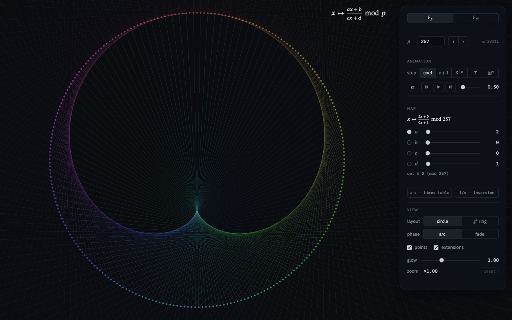
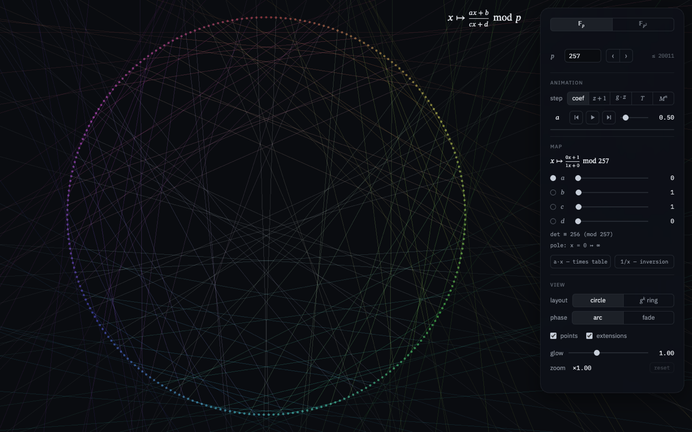
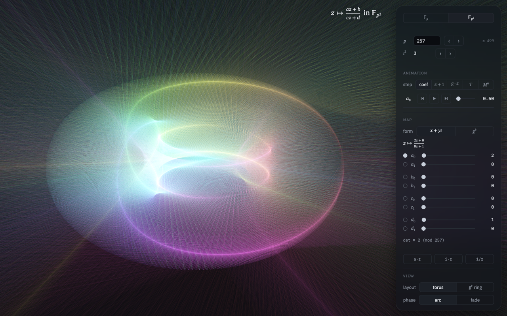
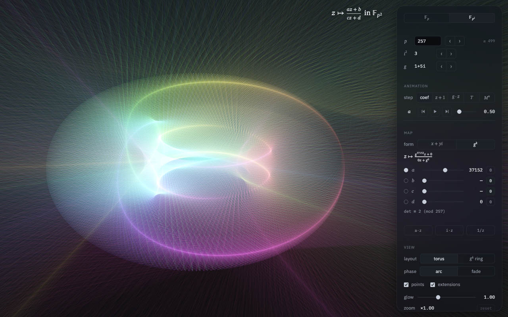

# Умножение в полях Галуа

Интерактивная визуализация дробно-линейного отображения

$$z \mapsto \frac{az + b}{cz + d}$$

над конечными полями $\mathbb{F}_p$ и $\mathbb{F}_{p^2}$. Элементы
$\mathbb{F}_p$ — точки окружности, элементы $\mathbb{F}_{p^2}$ — точки
тора; линия соединяет элемент с его образом.

Живая версия: [evgkch.github.io/galois](https://evgkch.github.io/galois/).
English: [README.md](README.md).

| [](https://evgkch.github.io/galois/) | [](https://evgkch.github.io/galois/?a=0&b=1&c=1&d=0) | [](https://evgkch.github.io/galois/?mode=fp2) |
| :--: | :--: | :--: |
| Карта $x \mapsto 2x$ при $p = 257$: огибающая хорд — кардиоида ([открыть](https://evgkch.github.io/galois/)). | Инверсия $x \mapsto x^{-1}$ при $p = 257$: хорды соединяют взаимно обратные элементы ([открыть](https://evgkch.github.io/galois/?a=0&b=1&c=1&d=0)). | Карта $z \mapsto 2z$ в $\mathbb{F}_{257^2}$: отрезки переходов и их продолжения ([открыть](https://evgkch.github.io/galois/?mode=fp2)). |

## Окружность: поле 𝔽p

Поле $\mathbb{F}_p$ — вычеты $\{0, 1, \dots, p-1\}$ по модулю простого $p$.
Его элементы — точки окружности в $\mathbb{R}^2$, по кругу в порядке
$0, 1, \dots, p-1$. Преобразование

$$x \mapsto \frac{ax + b}{cx + d} \pmod{p}$$

изображается линиями: отрезок соединяет точку $x$ с её образом.

Деление — умножение на обратный элемент: например, в $\mathbb{F}_7$
обратный к $3$ — это $5$, потому что $3 \cdot 5 \equiv 1$.

Совокупность $p$ отрезков изображает карту целиком; классическая «таблица
умножения на окружности» — частный случай $x \mapsto ax$. При $a = 2$
огибающая отрезков — кардиоида, при $a = 3$ — нефроида; при больших $a$ —
эпициклоиды с $a - 1$ остриями ([$a = 5$](https://evgkch.github.io/galois/?a=5)).

Полюс $x_0 = -d/c$ переходит в бесконечность проективной прямой
$\mathbb{P}^1(\mathbb{F}_p) = \mathbb{F}_p \cup \{\infty\}$; отрезок из
него не рисуется. При $ad - bc \equiv 0$ отображение вырождено — все
образы совпадают.

## Тор: поле 𝔽p²

Квадратичное расширение строится присоединением корня неприводимого
многочлена:

$$\mathbb{F}_{p^2} = \mathbb{F}_p[i]/(i^2 - \nu),$$

где $\nu$ — квадратичный невычет по модулю $p$. Например, при $p = 7$
квадраты ненулевых вычетов — $\{1, 2, 4\}$, и можно взять $\nu = 3$.
Каждый элемент однозначно записывается как $z = x + yi$; умножение
раскрывается по правилу $i^2 = \nu$. Обратный элемент выражается через
норму:

$$z^{-1} = \frac{\bar z}{N(z)}, \qquad N(z) = z\bar z = x^2 - \nu y^2, \qquad \bar z = x - yi.$$

Норма равна нулю только при $z = 0$, поскольку $\nu$ — не квадрат; поэтому
каждый ненулевой элемент обратим.

Элементы $\mathbb{F}_{p^2}$ — точки тора в $\mathbb{R}^3$: координаты $x$ и
$y$ откладываются вдоль двух обходов тора, обе периодичны с периодом $p$.
Преобразование изображается линиями в $\mathbb{R}^3$: отрезок соединяет
точку $z$ с её образом. Та же поверхность получается из таблицы
умножения $p \times p$ склейкой противоположных краёв.

Выбор невычета $\nu$ фиксирует базис $\{1, i\}$, а с ним и координаты: одна
и та же абстрактная карта при разных $\nu$ рисуется по-разному. Аффинные
карты с коэффициентами из простого подполя от $\nu$ не зависят; инверсия
$z \mapsto z^{-1}$ — зависит ([$\nu = 3$](https://evgkch.github.io/galois/?mode=fp2&a0=0&b0=1&c0=1&d0=0), [$\nu = 5$](https://evgkch.github.io/galois/?mode=fp2&a0=0&b0=1&c0=1&d0=0&ns=5)).

## Геометрические прогрессии и логарифмическая укладка

Мультипликативная группа $\mathbb{F}_q^{\times}$ (здесь $q = p$ или $p^2$)
циклична: для образующей $g$ каждый ненулевой элемент единственным образом
равен $g^k$, $0 \le k < q - 1$. Например, в $\mathbb{F}_7$ образующая —
тройка: её степени $3, 2, 6, 4, 5, 1$ перебирают все ненулевые вычеты.

**Экспоненциальная форма**: коэффициент задаётся показателем $k$ в записи
$g^k$; нулевой элемент — не степень $g$. Шаг анимации в этой форме умножает
коэффициент на $g$ — коэффициент пробегает геометрическую прогрессию
$g^k, g^{k+1}, \dots$

**Логарифмическая укладка**: ненулевые элементы лежат на кольце в порядке
показателей $k$, нуль — в центре. Умножение на $g$ в этой укладке — поворот
кольца на один шаг ([пример](https://evgkch.github.io/galois/?layout=log&step=mul&play=1)), а все хорды карты $x \mapsto ax$ стягивают дуги одной и
той же длины.

В логарифмической шкале геометрическая прогрессия равномерна, а в шкале
значений распределена как случайная последовательность (те же степени
тройки: $3, 2, 6, 4, 5, 1$). В логарифмической укладке картинка меняется
при смене образующей $g$.

## Анимация

Переключатель «step» задаёт, что делает один шаг транспорта:

| Шаг   | Действие                                                                    |
| ----- | ---------------------------------------------------------------------------- |
| coef  | $+1$ к выбранной кружком компоненте; в форме $g^k$ — умножение её на $g$      |
| z+1   | вся карта: $M \mapsto SM$ со сдвигом $S\colon z \mapsto z + 1$                |
| g·z   | вся карта: $M \mapsto SM$ с гомотетией $S\colon z \mapsto gz$                 |
| T     | вся карта: $M \mapsto TM$ с матрицей $T$ из четырёх полей ввода               |
| $M^n$ | итерация самой карты: $n$-й шаг показывает $M^n$ ([пример](https://evgkch.github.io/galois/?step=iter&play=1)) |

Шаги z+1, g·z, T и $M^n$ обратимы, поэтому путь не выходит из
$\mathrm{PGL}_2(\mathbb{F}_q)$ и не проходит через вырожденные карты; путь
coef может пересекать множество $ad - bc \equiv 0$. Дискриминант

$$\Delta = (\mathrm{tr}\, S)^2 - 4 \det S$$

определяет тип шага $S$: hyperbolic — $\Delta$ квадрат, две неподвижные
точки на прямой; parabolic — $\Delta = 0$, одна; elliptic — $\Delta$
неквадрат, неподвижных точек на прямой нет — они лежат в квадратичном
расширении. Например, шаг $z \mapsto -1/z$ при $p \equiv 3 \pmod 4$
эллиптичен: его неподвижные точки — корни уравнения $z^2 = -1$, а они есть
только в $\mathbb{F}_{p^2}$ ([пример](https://evgkch.github.io/galois/?p=103&step=T&t=0,102,1,0&play=1)). Панель показывает тип и порядок шага: через
столько шагов анимация возвращается к исходной карте.

Переключатель «phase» задаёт отрисовку дробной фазы между шагами: arc —
конец хорды скользит по дуге к следующему образу; fade — обе соседние
диаграммы рисуются с весами $1 - t$ и $t$. Промежуточных карт внутри
конечного поля нет: arc — интерполяция вложения, fade показывает только
сами карты. Для сдвигов, а в логарифмической укладке и для g·z, дуговая
интерполяция совпадает с точным потоком.

[](https://evgkch.github.io/galois/?mode=fp2&form=exp)

Коэффициенты в форме $g^k$: $a = g^{37152} = 2$, знаменатель — $g^0 = 1$;
образующая $g = 1 + 5i$ ([открыть](https://evgkch.github.io/galois/?mode=fp2&form=exp)).

## Управление

| Элемент     | Действие                                                                 |
| ----------- | ------------------------------------------------------------------------ |
| 𝔽p / 𝔽p²   | переключает окружность и тор                                             |
| p           | характеристика поля; ‹ › шагают по простым, максимум показан рядом       |
| i²          | квадратичный невычет $\nu$, задающий $i$ (только $\mathbb{F}_{p^2}$)     |
| g           | образующая $\mathbb{F}_q^{\times}$ (форма $g^k$ и шаг g·z)               |
| form        | форма коэффициентов: $x + yi$ или $g^k$                                  |
| кружок в строке коэффициента | выбирает, какой коэффициент двигает транспорт (шаг coef) |
| step        | что делает шаг: coef, z+1, g·z, T или $M^n$                              |
| phase       | отрисовка фазы между шагами: дуга или кросс-фейд                         |
| layout      | порядок элементов: по значению или по дискретному логарифму              |
| ⏮ ▶ ⏭       | шаг $-1$, воспроизведение и пауза (пробел), шаг $+1$                     |
| speed       | шагов в секунду; полоска под транспортом — фаза перехода                 |
| пресеты     | a·x и 1/x на окружности; a·z, i·z и 1/z на торе                          |
| view        | точки; продолжения хорд; glow; zoom                                      |
| мышь        | колесо — зум ×0.1–×10; тянем по тору — он вращается; двойной клик — сброс |

## Параметры URL

| Параметр            | Значение                                          |
| ------------------- | ------------------------------------------------- |
| mode=fp2            | стартовый режим — тор                             |
| p=257               | характеристика поля                               |
| a…d, a0…d1          | коэффициенты соответствующего режима              |
| form=exp            | коэффициенты в форме $g^k$                        |
| ns=5                | квадратичный невычет для $i^2$ (проверяется)      |
| g=1,5               | образующая парой $u,v$ (проверяется)              |
| step=add\|mul\|T\|iter | режим шага анимации                            |
| t=2,3,1,4           | матрица шага T                                    |
| arm=b0              | коэффициент, выбранный для шага coef              |
| phase=fade          | кросс-фейд вместо дуговой интерполяции            |
| layout=log          | укладка по дискретному логарифму                  |
| points=0, ext=0     | выключают точки и продолжения хорд                |
| glow=1.5            | экспозиция тонмаппинга                            |
| zoom=0.7            | зум                                               |
| play=1, speed=0.5   | автозапуск анимации и её скорость                 |

Пример: `?mode=fp2&p=101&a1=1&step=mul&layout=log&play=1`.

## Запуск

```
npm install
npm run dev
```

## Литература

Арнольд В. И. Динамика, статистика и проективная геометрия полей Галуа. —
М.: МЦНМО, 2005. — 72 с. —
[pdf на сайте МЦНМО](https://old.mccme.ru/free-books/arnold/VIA-Galua.pdf).
